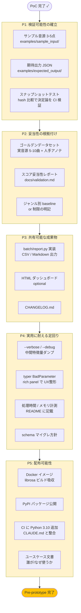
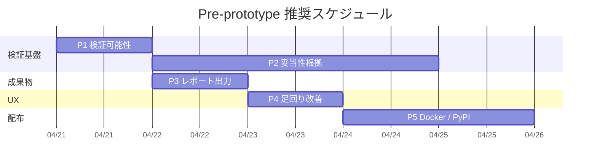

# Roadmap — PoC → Pre-prototype Milestones

本ドキュメントは svp-rpe の現状 (PoC) と次段階 (Pre-prototype) をフローチャートとマイルストーンで可視化する。

- **PoC** = コアパイプラインが動く段階 (現状)
- **Pre-prototype** = 外部レビュアーが検証・評価できる段階 (次)

> **目的別の詳細ロードマップ**: 「定量観測（目的1）完成」までの専用計画は
> [`docs/roadmap_goal1.md`](roadmap_goal1.md) を参照。
> 本ドキュメントは段階軸（PoC / Pre-prototype）、roadmap_goal1.md は目的軸の整理。

---

## 1. PoC フローチャート (現状: v0.2)

```mermaid
flowchart TD
    Start([開始]) --> M0

    subgraph M0[M0: プロジェクト基盤]
        M0a[src layout / pyproject]
        M0b[Pydantic v2 models]
        M0c[YAML config ローダ]
        M0d[typer CLI 雛形]
    end

    M0 --> M1

    subgraph M1[M1: RPE 抽出層]
        M1a[audio_loader<br/>WAV/MP3/FLAC]
        M1b[physical_features<br/>RMS/crest/spectral/BPM/key]
        M1c[structure_novelty<br/>+ labels]
        M1d[valley 3戦略<br/>percentile/section_ar/hybrid]
        M1e[semantic_rules<br/>ルールベース写像]
    end

    M1 --> M2

    subgraph M2[M2: SVP 生成層]
        M2a[generate_svp<br/>5ブロック構造]
        M2b[render_yaml / render_text]
        M2c[parse_svp<br/>YAML+text 双方向]
    end

    M2 --> M3

    subgraph M3[M3: 評価層]
        M3a[scorer_rpe<br/>Pro baseline 比]
        M3b[scorer_ugher<br/>4成分 意味整合]
        M3c[scorer_integrated<br/>重み統合]
        M3d[compare エンジン<br/>+ action_hints]
    end

    M3 --> M4

    subgraph M4[M4: CLI / バッチ]
        M4a[extract / generate]
        M4b[evaluate / compare]
        M4c[run フルパイプライン]
        M4d[batch ディレクトリ処理]
    end

    M4 --> M5

    subgraph M5[M5: 品質保証]
        M5a[pytest 79件]
        M5b[ruff clean]
        M5c[CI matrix 3.11/3.12]
        M5d[docs: architecture/cli/metrics]
    end

    M5 --> PoCDone([PoC 完了 ✓])

    style M0 fill:#d4edda
    style M1 fill:#d4edda
    style M2 fill:#d4edda
    style M3 fill:#d4edda
    style M4 fill:#d4edda
    style M5 fill:#d4edda
    style PoCDone fill:#28a745,color:#fff
```

### PoC 完了基準 (達成済み)

- [x] 音声入力から RPE/SVP/スコアが end-to-end で出力される
- [x] 同一入力 → 同一出力 (決定論) がコードレベルで保証される
- [x] LLM / 外部 API に依存しない
- [x] pytest / ruff / CI がすべて green
- [x] 6 つの CLI コマンドがすべて動作する

---

## 2. Pre-prototype フローチャート (次段階)

### Pre-prototype 完了基準

- [ ] 外部レビュアーが自前のサンプル音源でパイプラインを実行・比較できる
- [ ] スコアが人手評価と一致する根拠が少なくとも1件示されている
- [ ] batch 結果が CSV/MD で共有できる
- [ ] インストール失敗率が低い (Docker or PyPI)
- [ ] エラー発生時に raw traceback が出ない
- [ ] 実音源1曲あたりの処理時間が文書化されている

---

## 3. マイルストーン詳細

### M0–M5 (PoC: 完了済み)

詳細は git log 参照。主要コミット:

| Tag | コミット | 内容 |
|---|---|---|
| M0 | `a863128` | src layout / Pydantic / config / CLI stub |
| M1–M3 | `54c6873` | full pipeline (audio → RPE → SVP → eval) |
| M4 | `7d1b903` | CLI 接続 + E2E tests (v0.1.0) |
| M5 | `22bfa48` | v0.2 — compare / batch / semantic 4-component / valley 戦略 / novelty |
| QA | `8b8c87d` | self-review 10件対応 |

### P1: 検証可能性の確立 (優先度: ★★★)

**目的**: 「動く」から「検証できる」へ。

| ID | 成果物 | 受け入れ条件 |
|---|---|---|
| P1-01 | `examples/sample_input/*.wav` 3-5点 | 合成サイン波 or CC0 音源、ジャンル多様 |
| P1-02 | `examples/expected_output/*.json` | 各サンプルに対する RPE/SVP/score |
| P1-03 | `tests/test_snapshot.py` | hash 比較で出力の一致を CI 検証 |
| P1-04 | `scripts/regenerate_snapshots.py` | 期待値更新スクリプト |

**推定工数**: 0.5 日

### P2: 妥当性の根拠付け (優先度: ★★★)

**目的**: 「このスコアは信じていいのか」に答える。

| ID | 成果物 | 受け入れ条件 |
|---|---|---|
| P2-01 | `docs/validation.md` | 実音源 5-10曲に対するスコアと人手評価の比較表 |
| P2-02 | ゴールデンデータセット定義 | ジャンル / 曲長 / BPM 分布が偏らない選定 |
| P2-03 | `config/baselines/` | ジャンル別 Pro baseline (or 単一 baseline の妥当性検証) |

**推定工数**: 2–3 日 (人手アノテーション含む)

### P3: 共有可能な成果物 (優先度: ★★)

**目的**: 結果を他人に渡せる形にする。

| ID | 成果物 | 受け入れ条件 |
|---|---|---|
| P3-01 | `batch/report.py` 実装 | CSV + Markdown 出力、ランキング/統計込み |
| P3-02 | `svprpe batch --report md` | CLI オプション追加 |
| P3-03 | `CHANGELOG.md` | v0.1 / v0.2 / v0.3 の差分明記 |

**推定工数**: 0.5–1 日

### P4: 実用に耐える足回り (優先度: ★★)

**目的**: エラー時と長時間実行時の体験を改善する。

| ID | 成果物 | 受け入れ条件 |
|---|---|---|
| P4-01 | `--verbose` / `--debug` フラグ | 中間特徴量・処理時間ログ出力 |
| P4-02 | CLI エラーハンドリング | typer.BadParameter + rich panel で traceback 抑制 |
| P4-03 | ベンチマーク記載 | README に "5分曲で約Xs" 等 |
| P4-04 | `docs/migration.md` | schema_version 変更時の方針 |

**推定工数**: 1 日

### P5: 配布可能性 (優先度: ★)

**目的**: インストール障壁を下げる。

| ID | 成果物 | 受け入れ条件 |
|---|---|---|
| P5-01 | `Dockerfile` + `docker-compose.yml` | `docker run` で svprpe が動く |
| P5-02 | PyPI 公開 (任意) | `pip install svp-rpe` |
| P5-03 | CI に Python 3.10 追加 | CLAUDE.md 宣言との整合 |
| P5-04 | `docs/usecases.md` | 想定ユーザ・シナリオ 3 件以上 |

**推定工数**: 1–2 日

---

## 4. 推奨実行順

**クリティカルパス**: P1 → P2 (検証基盤の確立が全体の前提)
**並行可能**: P3 は P1 完了後すぐ着手可 (P2 の結論を待たない)

---

## 5. Pre-prototype から先の展望 (参考)

Prototype 段階で検討すべき項目:

- 埋め込みベース意味類似度 (token overlap → sentence-transformers)
- 深層学習による key / section 推定の置き換え
- バッチの並列化 (multiprocessing / ray)
- Web UI (Gradio / Streamlit)
- ジャンル別 baseline の自動学習
- SVP の逆方向生成 (SVP → 音響合成パラメータ)

これらは Pre-prototype 完了までは対象外とする。
