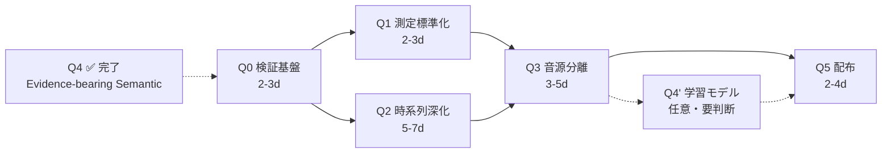

# Roadmap — 目的1（定量観測）完成計画

本ドキュメントは svp-rpe の **目的1「音楽を定量的に観測する」** を完成させるための
専用ロードマップ。段階軸（PoC / Pre-prototype）の [`roadmap.md`](roadmap.md) と
相補的に利用する。

各フェーズは Codex が独立で実装着手できる粒度に分解されている。
Codex への引き渡しは [`AGENTS.md`](../AGENTS.md) の Task Brief フォーマットを使う。

---

## 「目的1 完成」の定義

以下 5 点が同時に満たされた状態を **完成** と定義する（外部レビュアーに
「定量観測ツール」として渡せる水準）:

1. **すべての既存指標が ground-truth で検証されている** — BPM/key/structure 等の
   推定誤差が文書化されている
2. **業界標準の指標が抜けていない** — 少なくとも LUFS / downbeat / time_signature /
   chord / melody が観測可能
3. **音源分離後の per-stem 観測が可能** — vocal/drums/bass を分けた RPE が取れる
4. **ジャンル別 / フォーマット別 baseline が docs に明記されている** — Pro 1
   セットの硬直性を解消
5. **再現可能な検証データセット（5–10 曲）** が `examples/` + `docs/validation.md`
   に存在

満たさないと「内部試作」止まりで、目的1 が掲げる「定量観測」として主張できない。

---

## フェーズ構成

既存 [`roadmap.md`](roadmap.md) の P1–P2 を Q0 に取り込み、その先を Q1–Q4 に拡張する。

### Q0: 検証基盤の確立（既存 P1–P2 統合・拡張）

**目的**: 「動く」から「測定の妥当性が検証できる」へ。
**これが無いと Q1 以降の改善効果が定量比較できない。**

| ID | 成果物 | 受け入れ条件 |
|---|---|---|
| Q0-1 | `examples/sample_input/` に 5 曲（合成サイン波 + CC0 音源、ジャンル多様） | BPM / key / 拍子の真値が事前に既知 |
| Q0-2 | `examples/expected_output/` に各曲の RPE / SVP / score JSON | hash 安定性確認済み |
| Q0-3 | `tests/test_snapshot.py` | CI で hash 比較が pass |
| Q0-4 | `mir_eval` を `[test]` extra に追加 + `scripts/validate_against_truth.py` | BPM / key / onset の対真値比較が走る |
| Q0-5 | `docs/validation.md` 初版 | 5 曲での BPM 誤差・key 一致率・section 境界誤差を表で記録 |

**完了基準**: 5 曲で BPM 誤差 < 5 BPM, key 一致率 > 60%, snapshot CI green。
**推定工数**: 2–3 日

### Q1: 測定の標準化（業界基準への引き上げ）

**目的**: ad-hoc な measurement を ITU / MIR コミュニティ標準に置き換える。

| ID | 成果物 | 受け入れ条件 |
|---|---|---|
| Q1-1 | `pyloudnorm` 統合 → `loudness_lufs_integrated`, `true_peak_dbfs` を `PhysicalRPE` に追加 | ITU-R BS.1770 リファレンス音源と ±0.5 LU 一致 |
| Q1-2 | 拍子検出 — beat interval ヒストグラムから 3/4, 4/4, 6/8 を判別 | hardcode `"4/4"` の撤廃、3 曲以上の 3/4 サンプルで判別正解 |
| Q1-3 | BPM 信頼度の再設計 — `1 - abs(bpm-120)/120` の代わりに tempo histogram の rank ベース | 真値 ±5 BPM 以内のとき confidence > 0.7 |
| Q1-4 | `pro_baseline.yaml` を「Pro / Loud Pop / Acoustic / EDM」の 4 セットに拡張 + ジャンル選択ロジック | scorer_rpe が `--baseline edm` 等で切替可能 |

**完了基準**: validation.md に LUFS の対 ITU 標準の差分、time_signature 推定の
混合行列、ジャンル別スコアの妥当性が記録されている。
**推定工数**: 2–3 日

### Q2: 時系列の深化（曲の中で何が起きているか）

**目的**: 「曲全体の単一値」観測から「時間軸上の変化」観測へ。

| ID | 成果物 | 受け入れ条件 |
|---|---|---|
| Q2-1 | `madmom` 統合 → `downbeat_times: List[float]` を `PhysicalRPE` に追加 | 5 曲のうち 4 曲で downbeat 一致率 > 80% |
| Q2-2 | コード進行抽出（`autochord` 推奨、軽量で依存少） → `ChordEvent` 配列 | 主要 3 コード（I/IV/V）が時刻付きで取得可能 |
| Q2-3 | メロディ抽出（`pyin` 統合） → `MelodyContour`（時刻 + pitch + voicing） | ボーカル明瞭曲で ±50¢ 精度 |

**完了基準**: 5 曲のうち 3 曲でコード進行が「主要 3 コード」を一致、メロディが
pyin の voicing > 0.5 区間で ±50¢ 精度。
**推定工数**: 5–7 日（コード進行が時間がかかる）

### Q3: 音源分離の前提化

**目的**: 混在波形での測定の限界（「ベースの BPM」「ボーカルの brightness」が
取れない）を解消。

| ID | 成果物 | 受け入れ条件 |
|---|---|---|
| Q3-1 | `Demucs`（軽量 `htdemucs_ft`）統合 | 5 分曲が 60 秒以内に分離完了（CPU） |
| Q3-2 | stems / {vocal, drums, bass, other} 各々に既存 pipeline を再適用 | `PhysicalRPE.stem_rpe: dict[str, PhysicalRPE]` |
| Q3-3 | stem 別 baseline 拡張（少なくとも vocal / instrumental） | per-stem score が出力される |
| Q3-4 | `--separate` CLI flag（重いので opt-in） | デフォルトは無効、ジャンル分析で有効化 |

**完了基準**: vocal / drums / bass 分離後の RMS 合計 vs 元曲の残差 < 5%、
per-stem BPM が full mix と一致。
**推定工数**: 3–5 日

### Q4: Evidence-bearing Semantic Layer ✅ **完了 (PR #8, 2026-04-27)**

**目的**: librosa の物理特徴で観測された事実を、**根拠付きの意味ラベル**として
表現する層を整備する。学習モデルを採用せず、ルールベースのまま「どの物理量が
どのラベルを根拠付けているか」「どの程度の信頼度で言えるか」「どの抽象度の
主張なのか」を明示する設計。

**実装サマリ** (PR #8):

- `SemanticRPE.por_surface` の型を `list[str]` → `list[SemanticLabel]` に変更
  （schema_version 1.0 → 2.0、legacy は fail-fast で拒否）
- `SemanticLabel` フィールド: `label`, `layer`, `confidence`, `evidence`, `source_rule`
- 3 層分離: `perceptual` (知覚事実) / `structural` (構造事実) /
  `semantic_hypothesis` (確証度の低い意味推定)
- `SVPBundle` 出力時は `_label_texts()` で文字列に flatten し、SVP 表面互換性を維持
- `generation_hints.candidate_context` で confidence < 0.70 の semantic_hypothesis
  を SVP 利用側に渡す（採用判断は呼び出し側）
- `cultural_context` を独立フィールドに昇格、`semantic_rules.yaml` を 6 → 多数に拡充
- 詳細: [`docs/migration.md`](migration.md)

**設計上の判断**:

- 「学習モデル不使用」の暗黙原則は **維持**（Essentia 等の採用は別途判断）
- ルールベースのまま「観測 → 意味」の橋渡しに **証拠と信頼度** を持たせる
  ことで、決定論性を損なわず意味層の品質を引き上げる第三の道を選択
- 学習モデル採用は本ロードマップの完了定義から外し、別途 Q4' として将来検討

**未活用 / フォローアップ余地**:

- `eval/scorer_ugher.py` と `eval/comparison.py` は現状 `por_core` / `grv_anchor` /
  `delta_e_profile` のみを参照しており、`por_surface[].confidence` /
  `evidence` / `layer` を活用していない。confidence 重み付け等で
  scorer 精度を引き上げる余地あり（Q4-fu1、別 Brief 化候補）
- `semantic_rules.yaml` のルール件数は更に拡充できる（Q4-fu2）
- ジャンル別の semantic ルール選択ロジックは未着手（Q1-4 と並走可能）

**Q4'（任意・将来検討）**: 学習済みモデル統合

| ID | 成果物 | 受け入れ条件 |
|---|---|---|
| Q4'-1 | 方針決定（`docs/learned_models_policy.md`） | 採用 / 見送りが明文化 |
| Q4'-2 (採用時のみ) | Essentia 統合 → mood / danceability / aggressiveness を `SemanticRPE.descriptors` に | confidence 付きで取れる、決定論性が維持される |

**判断ポイント**: README の「LLM 不要、API 不要、決定論」は Essentia の TF モデル
（固定 weight で決定論）でも維持可能だが、「学習モデル不使用」という暗黙原則は
緩むため **ユーザー判断を要する**。Q5 完了後に再評価する。（採用 / 見送り問わず）

### Q5: 配布・公開（既存 P3–P5 を縮約）

| ID | 成果物 |
|---|---|
| Q5-1 | `docs/coverage.md` — 「何が測れて何が測れないか」一覧表（README からリンク） |
| Q5-2 | `Dockerfile`（librosa + Demucs + madmom のビルド吸収） |
| Q5-3 | `CHANGELOG.md` |
| Q5-4 | （任意）PyPI 公開 |

**完了基準**: `docker run` で Q0–Q3 の全機能が動く。
**推定工数**: 2–4 日

---

## クリティカルパス & 並列化

- **クリティカルパス**: Q0 → Q1 → Q3 → Q5（最低 9–15 日）
- **並列可能**: Q1 と Q2 は独立着手可（Q0 完了後）
- **完了済**: Q4（Evidence-bearing Semantic Layer）は PR #8 で実装完了
- **任意**: Q4'（学習モデル統合）はスキップ可。本ロードマップの完了定義に含めない

**合計工数**: 14–22 日（Q4 完了済を反映、Q4' を除外）

---

## リスクと判断ポイント

| リスク | 対策 |
|---|---|
| madmom がビルド困難（Cython, 古い numpy 依存） | Docker 同梱を Q5 より前倒し、または `chord-extractor` で代替検討 |
| Demucs が CPU で 30 秒以上 / 5 分曲 | `--separate` を opt-in に、batch 並列化は対象外 |
| Q4'（学習モデル）の哲学トレードオフ | 完了定義から外し、Q5 後に再評価。現状 Q4 は Evidence-bearing で完了済 |
| ジャンル別 baseline のジャンル定義が曖昧 | Q1-4 で「曲のメタデータから自動選択」ではなく「ユーザー明示指定」に倒す |

---

## 既存 roadmap との関係

| 既存 (`roadmap.md`) | 本ドキュメント (`roadmap_goal1.md`) |
|---|---|
| 段階軸: PoC → Pre-prototype → Prototype | 目的軸: 目的1（定量観測）の完成 |
| P1: 検証可能性 / P2: 妥当性 | Q0 が P1 + P2 を統合・拡張 |
| P3: 共有可能成果物 | Q5 が縮約して引き継ぎ |
| P4: 足回り改善 | 本ロードマップでは扱わない（既存 P4 を別途参照） |
| P5: 配布 | Q5 と統合 |

目的2（再現実証）の専用ロードマップは別途 `docs/roadmap_goal2.md` として
整備予定（未着手）。
