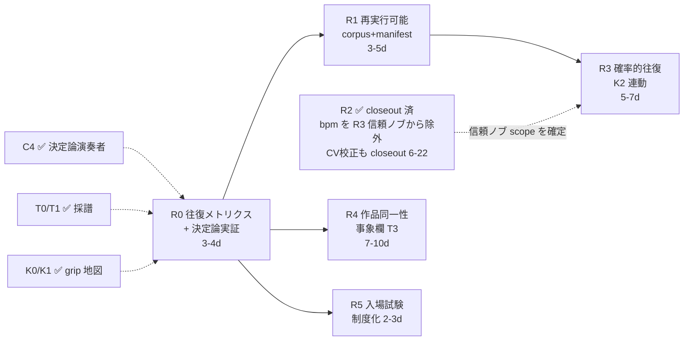

# Roadmap — 目的2（再現実証）完成計画

本ドキュメントは svp-rpe の **目的2「楽譜と演奏の双方向再現性を実証する」** を
完成させるための専用ロードマップ。段階軸の [`roadmap.md`](roadmap.md) と、
目的1（定量観測）の [`roadmap_goal1.md`](roadmap_goal1.md) と相補的に利用する。

- **目的1** = 計器（RPE 抽出・audit・eval）を **作り、校正する**（Q 系列）
- **目的2** = その計器を使って **双方向再現性を実証する**（本書・R 系列）

通底原理と概念の出自は [`score_centric_planning.md`](score_centric_planning.md) §2
（双方向再現性）に置く。本書はそれを **実証フェーズに分解した実行計画** であり、
既存の T 系列（採譜）/ K 系列（grip）/ Q 系列（校正）/ C 系列（作曲）の成果物を
**再現実証という一つの目的に束ねる上位ロードマップ**として機能する。

各フェーズは Codex が独立で実装着手できる粒度に分解する。引き渡しは
[`AGENTS.md`](../AGENTS.md) の Task Brief フォーマットを使う。

---

## 「目的2 完成」の定義

完成の主張は「演奏が楽譜を完全再現する」ことではなく、
**「往復でロック欄が保存されるかを field 単位で数値化し、保存／ツマミ死／
センサー盲の三値で診断できる状態が、決定論経路と確率的経路の双方で
文書化されている」**ことである。

以下 5 条件が同時に満たされた状態を **完成** と定義する:

1. **往復保存性メトリクスが定義・固定されている** — `楽譜 → 演奏 → 計器 → 楽譜′`
   の往復一致を field 単位で算出し、**保存 / ツマミ死で喪失 / センサー盲で喪失**
   の三値診断として出力する仕様が確定し、snapshot で固定されている
2. **決定論経路で往復保存が実証されている** — C4 決定論シンセ演奏者 + T1 採譜で
   in-repo テストが走り、grip 地図（K1）と整合する（grip=tight は保存、
   dead は喪失と診断される）
3. **確率的経路が再実行可能な形で実証されている** — 再実行可能 corpus（音源 +
   真値 + manifest）に対し、実生成器（Suno 級）での往復が少なくとも
   **送出かつ計器が信頼できる物理ノブ（現状 key / brightness）** で再現を示す
4. **復路の誤差注入源が校正され、bpm の扱いが確定している** — BPM 89.1
   アトラクタ（[`roundtrip_case_studies.md`](roundtrip_case_studies.md) §4）が
   Q1-3 で校正され、**再現対象に bpm を含められる**。校正が inclusion 水準
   （条件 3 の「計器が信頼できる物理ノブ」）に届かない場合は、**bpm を再現対象
   から明示的に除外し理由を記録する** — どちらの結論でも R2 から本定義・R3 の
   スコープへ伝播させ、矛盾を残さない（フォールバックは「未確定」ではなく
   「除外確定」）。
   **【確定: 2026-06-18, R2 closeout（PR #82–#86）】** bpm は **確率的経路（R3）の
   信頼再現ノブから明示除外** する。理由: faster-side（reported-too-slow / halving）は
   post-hoc な部分緩和（検出＋補正＋ confidence cap）に留まり principled fix（tempo
   prior 適応化）は別の高回帰タスクで OUT、**÷2 方向（reported-too-fast / doubling）は
   extractor では原理的に分離不能で高 confidence のまま素通りする**（#86 で AC 振幅 /
   beat-phase 交替 / 単独低 prior の 3 手法を実測反証）。よって bpm は「送出かつ計器が
   信頼できる物理ノブ」（条件 3 = key / brightness）に **含めない**。bpm は除外後も
   (a) **決定論経路（R0）の三値診断**では計測・`calibration_disagreement` として正直に
   surface し、(b) **corpus screener の prior 回復診断**（halving=高 prior / doubling=
   低 prior、stated 真値必須）で「抽出器要因 vs 生成器不忠実」を弁別する観測対象として
   残置する。詳細は [`roundtrip_preservation.md`](roundtrip_preservation.md) の
   per-field bpm trust（R2-3）。
5. **作品同一性が事象レベルで一周している（stretch）** — 旋律 / コード進行 /
   フックなど **作品を「その曲」たらしめる事象欄** の往復が示され、
   [`ai_music_daw_vision.md`](ai_music_daw_vision.md) §7 の「作品 = 楽譜」同一性
   主張が制作パラメータの一致を超えて成立する

加えて運用面で、**往復保存性をスキーマの入場試験として制度化する**
（[`score_centric_planning.md`](score_centric_planning.md) §2.2）— 新フィールドは
往復を生き残ることを示して初めて正規スキーマに入る。

### 通底原理 — 双方向再現性の分解

往復保存性は二つの独立な性質の積に分解でき、三トラックの存在理由がこの一式に収まる:

```text
往復保存性(field) ≈ grip(field) × 校正(field)

  grip   — 演奏者がそのフィールドを読んで出力に反映するか（K 系列が測る）
  校正   — 計器がその性質を目盛りとして読めるか（Q 系列が校正する）
  採譜   — 往復の帰り道そのもの（T 系列が実装する）
  作曲   — 往復の行き道（C 系列が実装する：Score → 演奏）
```

ロック欄が往復で失われるとき、原因は **ツマミ死**（演奏者が読まない）か
**センサー盲**（計器が読めない）のどちらか — K1 が確立した dead の 2 分類が
そのまま診断軸になる。目的2 は **この往復ループを閉じ、保存性を数値で語れる
状態**を成果物とする。

---

## 現状の棚卸し（2026-06-13）

目的2 の本体（往復ループ）は各トラックの成果物の合流で立つ。実装状況を
コード根拠で棚卸しする。**マーカー: ✅ = 受け入れまで達成 / ⏳ = 実装済みだが
往復実証の受け入れに残あり / ❌ = 未着手**。

> **更新（2026-06-18）**: **R2 / Q1-3（BPM 校正）は closeout 済** — bpm を確率的経路
> (R3) の信頼再現ノブから明示除外で確定（§R2 / 完成定義 §4）。下表・残作業の
> R2・bpm 関連セルはこの除外確定で上書きされ、残るのは非ブロッキングな
> `BPM_CONFIDENCE_CV_SCALE` follow-up のみ。
>
> **更新（2026-06-22）**: その `BPM_CONFIDENCE_CV_SCALE` follow-up も **closeout** —
> content-addressed loader（#92, Drive 非接続）で実音源 7 本を local source-dir から
> materialize し実測校正。`CV_SCALE=5.0`
> を据え置きで確定（preserved 3 本＝真値±5BPM の confidence 0.83–0.90 が Q1-3 契約
> >0.7 を**実音源で初実証**、実 CV∈[0.020,0.040]）。誤 BPM 4 本（octave_half 1 + off 3）も
> conf 0.80–0.85 と高く、CV-confidence が regularity-only で誤 BPM を検出しない＝bpm 除外を実データで
> 再確証。licensing **懸念**（公開 repo への著作権物同梱）は Drive 非同梱（content-address
> 解決）で回避。**ただし corpus の完全再現性は別問題で未達**: 7 本中 `drive_file_id` を持つ
> 3 本（shiden / yaoyorozu / so_what）が Drive 在処ポインタを持つ。ただし `fetch_corpus.py` は
> **Drive 非接続**で source-dir のバイトのみ照合するため、素の CI/checkout（手動 DL 無し）では
> 3 本含め 7 本とも `not_found`；3 本は Drive アクセス下で手動 DL すれば解決できる。`astral_trigger`
> + abc 実験 3 本はその在処ポインタすら無い upload-only hash。CV-scale 結論（5.0）は **Drive アクセス下で手動取得できる
> 3 本だけで成立**（preserved: shiden 0.901 / yaoyorozu 0.831 が >0.7、incorrect-BPM(off):
> so_what 0.798=誤 BPM でも高 conf で CV の regularity-only を示す。so_what は非octave の off で
> あり halving ではない — halving 固有例は upload-only 側）ため closeout は維持するが、**upload-only
> 4 本の Drive 化 + `drive_file_id`
> 付与は reproducible corpus の follow-up として open**（R1 artifact 作業、§R1）。

| トラック | 目的2 への寄与 | 状態 |
|---|---|---|
| C 系列（作曲＝行き道） | Score → TargetSVP → プロンプト / 決定論シンセ演奏者 | ✅ C1–C4 完了（[`composition_poc_report.md`](composition_poc_report.md)）。C4 が決定論演奏者として往復の行き道を提供 |
| T 系列（採譜＝帰り道） | 演奏 → 計測 → draft Score | ⏳ T0（per-field 計測）/ T1（`svprpe transcribe`）実装済み（PR #70/#71）。**T2（往復保存性の最小実証）が未着手** |
| K 系列（grip） | フィールドごとの「効き」地図 | ⏳ K0/K1 完了（決定論演奏者、PR #61/#65、dead 2 分類確立）。**K2（Suno 転移）未** |
| Q 系列（校正） | 復路の計器の目盛り付け | ✅ Q1-3（BPM 校正）closeout 済（2026-06-18, #82–#86）— bpm を R3 信頼ノブから除外確定。残 `BPM_CONFIDENCE_CV_SCALE` 実校正も closeout 済（2026-06-22 #92/#93・`CV_SCALE=5.0` 確定、Drive 解決可能 3 本で成立）。**upload-only 4 本の Drive 化は reproducible corpus の R1 follow-up として残**（§R1） |
| 実生成器先取り | 実 Suno での往復 n=1 | ⏳ [`roundtrip_case_studies.md`](roundtrip_case_studies.md): key/brightness で往復成功・bpm は除外確定（closeout）・音源未コミットで**再実行不可**（R1 で解消予定） |

**目的2 固有の残作業**（既存トラックの成果物を束ねる接着剤）は次の 4 点に偏る:

1. **往復保存性の正式メトリクス定義 + in-repo テスト** — T2 を目的2 の受け入れ
   ゲートへ昇格させる（R0）
2. **再実行可能 corpus + manifest** — roundtrip 検証が n=1・再測不可に留まる根因。
   音源 + 真値 + manifest の保存基盤（R1）
3. ~~**復路誤差源（bpm アトラクタ）の校正** — Q1-3 連動（R2）~~ **✅ closeout 済
   （2026-06-18）** — bpm を R3 信頼ノブから除外確定。残 CV-scale 校正も 2026-06-22 に
   実音源で closeout（#92 経由・`CV_SCALE=5.0` 確定）
4. **意味層 grip の機械確認** — 事象レベル欄（T3 / 急所1）が無いため、
   現状 rock↔EBM の差は耳でしか判定できない（R4）

---

## フェーズ構成（R 系列）

R 系列は目的2 固有のフェーズ ID。各 R フェーズは T / K / Q の成果物を **依存入力**
として明示し、目的2 = 再現実証 の受け入れゲートを定義する。

### R0: 往復保存性メトリクスの確立 + 決定論実証 ❌ **未着手（T2 を昇格）**

**目的**: §2 の双方向再現性を初めて数値にする。全区間決定論（演奏者 = C4
シンセ、採譜 = T1）で in-repo 完結する。

**依存**: C4（演奏者）✅ / T1（採譜）✅。実体は
[`score_centric_planning.md`](score_centric_planning.md) §3 **T2** と同一 —
本書はそれを目的2 の受け入れゲートとして再掲・昇格する。

| ID | 成果物 | 受け入れ条件 |
|---|---|---|
| R0-1 | 往復保存性メトリクス定義 — field ごとに `保存 / ツマミ死で喪失 / センサー盲で喪失` の三値を返す関数 + データ構造 | 三値判定ロジックが grip 地図（K1）とセンサー校正状態（Q / T0 校正メモ）を参照して決まることがコードで追える |
| R0-2 | 決定論往復ハーネス — `既存 Score → C4 演奏 → T1 採譜 → 元 Score と比較` を in-repo で実行 | 合成 5 曲で決定論的に走り、往復一致表が snapshot test で固定される |
| R0-3 | 往復一致表を docs に記録 | grip=tight のフィールドは保存、dead は喪失と診断され、K1 grip 地図と整合（相互検証） |

**完了基準**: 往復一致表が決定論で再現し、K1 grip 地図と矛盾しない。
これが「ハーネスが正しく測れている」ことの相互検証になる。
**推定工数**: 3–4 日

### R1: 再実行可能 corpus + manifest ❌ **未着手**

**目的**: 確率的経路の往復検証を **n=1・再測不可** から **再実行可能** へ。
[`roundtrip_case_studies.md`](roundtrip_case_studies.md) §6 が「校正の入力に
できない根因」として明示した前段タスク。

| ID | 成果物 | 受け入れ条件 |
|---|---|---|
| R1-1 | 往復 manifest スキーマ — `{プロンプト全文, 生成器, 真値(意図 bpm/key/拍子等), 計測値, 音源ハッシュ?, 音源ロケータ?(コミット相対パス or アーティファクト URI)}` を 1 ケース = 1 レコードで保存。**音源ハッシュ・ロケータは校正可能 corpus では必須、プロンプトのみの観測ログでは nullable**（音源が消失済みなので空） | 既存 4 ケース（roundtrip_case_studies §1）が観測ログ（ハッシュ・ロケータ空）として再記述でき、校正可能 corpus ではハッシュ + ロケータからハッシュ一致音源を解決できる |
| R1-2 | 再実行可能 corpus — **校正に使うケースは音源を保存**（コミット可能な CC0 音源、または確率的生成器出力はハッシュ一致するアーティファクトを repo 外ストアに保持し manifest から参照）。プロンプトのみのケースは別枠 | R2 が同一素材に別 BPM 推定器を当て直せる。プロンプトのみのケースは「新しい確率的サンプル」であり再利用可能な校正入力として扱わない |
| R1-3 | manifest ローダ + 往復バッチランナー（手動生成テイクの取り込み口） | manifest から往復一致表を再生成できる |

> **設計判断（reusable corpus の条件、PR #73 レビュー反映）**: 確率的生成器
> （Suno 級）は同一プロンプトを再実行しても**同じ音源を再生成しない**ため、
> 記録済みハッシュ・計測値に対応する音源が無いと R2 で別推定器を当て直せない。
> よって corpus を 2 層に分ける:
>
> - **校正可能 corpus** — 音源そのものを保持（CC0 はコミット、著作権が絡む生成器
>   出力はハッシュ一致するアーティファクトを repo 外に保持し manifest から参照）。
>   **所属条件は「ロケータが文書化された実行環境（CI / 別チェックアウト）で
>   解決でき、ハッシュ一致音源を取得できること」** — private bucket・期限切れ
>   署名 URL 等で解決不能なレコードは校正可能 corpus に数えず観測ログへ降格する。
>   個別の保存形態（コミット / 公開 URL / 認証付きストア + 取得手順）は問わず、
>   この**解決可能性**だけを membership 基準とする（保存形態を列挙しない）。
>   R2 / R3 の校正入力に使えるのはこの層のみ
> - **観測ログ（プロンプトのみ）** — `roundtrip_case_studies.md` の既存 4 ケースが
>   該当。「問題が実在することの証拠」に留め、**校正の入力とは扱わない**
>   （同上 §183-187）。再実行には音源 or ハッシュ一致 fixture の確保が前段で要る

**完了基準（R3 ブロッキング部分）**: roundtrip 既存 4 ケースが manifest 化され、
**R3 が検証する key / brightness 系の保存音源**（CC0 コミット or ハッシュ一致
アーティファクト）から往復を再実行できる。既存 4 ケースの音源は ephemeral で消失済みの
ため、key / brightness corpus は**保存付きで新規生成して確保**する。プロンプトのみの
ケースは校正可能 corpus に数えない。

**非ブロッキング follow-up（R2 CV 校正用、R1→R3 ゲート外）**: `BPM_CONFIDENCE_CV_SCALE`
実校正に必要な **BPM 問題ケース（89.1 アトラクタ / 175→89 半折りを示すテイク）を含む
保存音源**は、**R2 closeout（bpm を R3 信頼ノブから除外）により R1→R3 のゲートから外す**。
これは R2 CV-scale follow-up の入力としてのみ確保すればよく（保存できた範囲が CV 校正の
対象スコープを規定する）、R3 をブロックしない。

> **CV-scale follow-up は closeout（2026-06-22）**: content-addressed loader（#92, Drive 非接続）で
> BPM 問題ケース（so_what 172→117 / astral 175→117 / expA 176→89 等）を含む実音源を
> materialize し、`compute_bpm` の confidence/CV を実測。`CV_SCALE=5.0` を据え置きで確定
> （実 CV∈[0.020,0.040]、preserved 3 本で Q1-3 契約 >0.7 を実音源実証）。コード変更なし。
> **ただし reproducible corpus 自体は未完**: `fetch_corpus.py` は Drive 非接続で source-dir の
> バイトのみ照合するため、素の CI/checkout では 7 本とも `not_found`。校正に使った 7 本中、
> Drive 在処ポインタ（`drive_file_id`・手動 DL 前提）を持つのは 3 本のみで、`astral_trigger` +
> abc 実験 3 本はそのポインタすら無い upload-only hash。**3 本の手動 DL（要 Drive アクセス）+
> この 4 本を Drive へ上げて `drive_file_id` を付与する artifact 作業が R1 の残タスクとして
> open**（CV-scale 結論自体は Drive アクセス下で手動取得できる 3 本で成立）。
**推定工数**: 3–5 日（key / brightness corpus 確保・ライセンス確認を含む。BPM ケース確保は
follow-up 側）

> **補足**: 確率的生成器は n=1 では効果量を主張できない（同上 §6）ため、
> manifest は **少数バッチ反復**を前提に複数テイクを束ねられる形にする。

### R2: 復路誤差源の校正 — BPM アトラクタ ✅ **closeout 済（2026-06-18, #82–#86）— bpm を確率的経路(R3)の信頼再現ノブから明示除外で確定。残 `BPM_CONFIDENCE_CV_SCALE` 実校正も 2026-06-22 に実音源で closeout（#92 経由・`CV_SCALE=5.0` 据え置き確定）**

**目的**: 採譜（音 → 楽譜）の復路で **BPM だけが誤差を注入する漏れ穴**
（[`roundtrip_case_studies.md`](roundtrip_case_studies.md) §4: 生成 3 曲が全て
raw 89.10、J-rock は真値 175→89 の半折り）を塞ぐ。

**依存（historical / closeout 済）**: 下記は校正アプローチを採った場合の依存で、
**R2 closeout により R3 をブロックしない**。closeout の結論（bpm を R3 信頼ノブから
除外）は full R1-audio 校正を要さず、検出器系列（#82–#86）+ screener 診断で確定した。
残る `BPM_CONFIDENCE_CV_SCALE` 実校正のみが R1（**BPM 問題ケースを含む** 再実行可能
corpus）/ [`roadmap_goal1.md`](roadmap_goal1.md) **Q1-3** に依存していたが、これは bpm
confidence を精緻化するだけの**非ブロッキング follow-up** で、**2026-06-22 に実音源
（#92 で materialize した 7 本）で校正実施・`CV_SCALE=5.0` 据え置き確定して closeout**。

| ID | 成果物 | 受け入れ条件 |
|---|---|---|
| R2-1 | BPM 89.1 アトラクタの再現確認 — R1 corpus に現行推定器を当て、アトラクタ／半折りが再現するか記録 | 問題が「計器の癖」であってパイプラインのバグでないことが再実行可能な形で示される |
| R2-2 | **既存の CV ベース BPM 信頼度を校正**（`BPM_CONFIDENCE_CV_SCALE`, `rpe/physical_features.py`）し、半折り（×2 / ÷2）曖昧性の検出を上乗せ。再設計でなく既存式の調整 + 半折り検出の追加とし、production コードと `tests/test_bpm_confidence.py` を同時更新 | `tests/test_bpm_confidence.py` の Q1-3 契約（真値 ±5 BPM 以内で confidence > 0.7）を割らず、半折り検出時は低 confidence + 候補列挙 |
| R2-2a ✅ | **半折り（×2）検出** done — `detect_bpm_octave_ambiguity` + `PhysicalRPE.bpm_octave_ambiguous` / `bpm_candidates`、ambiguous 時に extractor が `bpm_confidence` を 0.5 cap（`tests/test_bpm_octave_ambiguity.py`、metrics.md「BPM Half-fold Detection」）。音源非依存スライス | Q1-3 fixture は誤検出されず（ratio ≤ 1.001 < 1.15）契約不変。×2 方向のみ（÷2 方向は #86 で決着、CV scale 実校正は #92/#93 で実音源 closeout＝R2-2f） |
| R2-2b/2c/2d ✅ | **検出器の一般化** done — 固定 2×lag→近傍探索（1.4–2.2×, #82/#84）でグリッド量子化 halving と 3:2 subharmonic「117.45 アトラクタ」を包摂、ambiguous 時に reported bpm を回復テンポへ補正（#83、transcribe trust gate は flag で sensor-blind 維持） | faster-side（reported-too-slow）の post-hoc 緩和。principled fix（tempo prior 適応化）は別の高回帰タスクで OUT |
| R2-2e ✅ | **÷2 方向（reported-too-fast / doubling）の決着** done（#86）— extractor では AC 振幅 / beat-phase 交替 / 単独低 prior の 3 手法いずれも分離不能と実測反証。screener 限定の低 prior（`LOW_PRIOR_START_BPM=50`）診断で「抽出器 doubling vs 生成器不忠実」を弁別 | extractor は ÷2 を高 confidence で素通り（synth_01 真60→117.45, conf 0.877, 非フラグ）。`bpm_doubling_prior_recovery`、負の結果は roundtrip_corpus_screen.md に外部化 |
| R2-2f ✅ | **CV-scale 実音源校正** done（2026-06-22, #92/#93）— content-addressed loader（Drive 非接続）で実音源 7 本を local source-dir から materialize し `compute_bpm` の confidence/CV を実測（素 CI/checkout では 7 本とも not_found・Drive ポインタは 3 本のみ）。`CV_SCALE=5.0` 据え置きで Q1-3 契約（preserved 3 本 conf 0.83–0.90 > 0.7）を**実音源で実証**、実 CV∈[0.020,0.040] | 誤 BPM 4 本（octave_half 1 + off 3）も conf 0.80–0.85（CV は regularity-only で誤 BPM 不検出）→ bpm 除外を実データ再確証。production コード変更なし（5.0 妥当性確認）。データ: [`roundtrip_corpus_screen.md`](roundtrip_corpus_screen.md) |
| R2-3 ✅ | 校正メモを T0 per-field 校正メモへ反映 done — bpm trust を [`roundtrip_preservation.md`](roundtrip_preservation.md) の K1 Cross-Check / Follow-Up Routing に明記 | 「この針はどこまで信用して bpm を転記できるか」が往復ハーネスの三値診断に効く |

**完了基準** ✅（2026-06-18, R2 closeout）: 検出器系列（#82–#86）と corpus screener
診断で BPM の保存性が field 単位で読め、結論が **bpm を確率的経路（R3）の信頼再現ノブ
から明示除外**（理由 = faster-side は post-hoc 部分緩和・÷2 は extractor 分離不能）と
**根拠付きで確定**し、完成定義 §4 と R3 のスコープ（R3-2 は元から key / brightness 限定）
へ伝播済み。bpm は決定論経路（R0）の三値診断と screener の prior 回復診断に観測対象として
残置する。残っていた `BPM_CONFIDENCE_CV_SCALE` 実校正も **2026-06-22 に closeout**
（#92 の実音源 materialize で `CV_SCALE=5.0` 据え置き確定）。除外結論は不変。
**推定工数**: 3–4 日（実績: 検出器系列 + closeout）

> **注意**: 再採譜を連鎖させると BPM だけがテンポ半分へドリフト伝播する
> （同上 §4）。往復を複数周回す実験では bpm のドリフトを監視対象にする。

### R3: 確率的演奏者での往復実証 ❌ **未着手（K2 連動）**

**目的**: 決定論（R0）で立った往復を、本命の **確率的演奏者（Suno 級）** で
実証する。K1 grip 地図が「配線既知の決定論演奏者」での測定だったのに対し、
転移の確認（K2）はコンセプトの土台に関わる
（[`score_centric_planning.md`](score_centric_planning.md) §6 急所2）。

**依存**: R1（再実行可能 corpus の **key / brightness 部分**）/ K2。
**R2 はブロッカーではない** — R2 closeout（2026-06-18, bpm を R3 信頼ノブから除外確定）
の scope 決定を入力として受けるのみで、bpm 校正の完了を待たない（CV-scale 校正も
2026-06-22 に実音源で closeout 済・#92/#93、R3 への影響なし）。

| ID | 成果物 | 受け入れ条件 |
|---|---|---|
| R3-1 | 物理固定・意味差替の A/B バッチ（roundtrip §3 の手法を反復化） | 同一物理ノブで意味層のみ差し替えたテイク群を manifest で束ねる |
| R3-2 | 送出ノブの往復一致率（少数バッチ、n>1） | key / brightness の往復一致が n>1 で再現（効果量の最初の点推定） |
| R3-3 | 「選択 = 制御」フォールバックの実証（rejection sampling）— N テイク生成 → 計器で測定 → 楽譜に最も近いテイク採用 | grip が弱いノブでも、センサーのみで制御チャネルが回復することを示す（同上 §6 急所2 の保険） |

**完了基準**: 送出かつ計器が信頼できる物理ノブ（最低 key / brightness）で
往復一致が n>1 で示され、grip が弱い欄については rejection sampling で制御が
回復することが示される。
**推定工数**: 5–7 日（律速は手動生成バッチ＝人間の作業時間。Claude/Codex
サイクルとは競合しない）

### R4: 作品同一性 — 事象レベル欄の往復 ❌ **未着手（T3 / 急所1）**

**目的**: 制作パラメータ（bpm/key/brightness/密度）の往復が綺麗に回っても、
それは **注文票（スタイルシート）の往復** に過ぎない。曲を「その曲」たらしめる
**音楽的事象**（旋律モチーフ・コード進行・フック）の往復を実証して初めて
「作品 = 楽譜」同一性が成立する
（[`score_centric_planning.md`](score_centric_planning.md) §6 急所1）。

**依存**: R0（往復ループ確立 = §2.2 入場試験の試験台）/
[`event_roundtrip.md`](event_roundtrip.md)（R4-1: コード進行の DD-D 解除条件）。
コード進行は決定論センサー `compute_chord_events` が既存のため、学習モデル隔離は
コード経路のクリティカルパスではなく、将来の精度 upgrade として扱う。

| ID | 成果物 | 受け入れ条件 |
|---|---|---|
| R4-1 ✅ | [事象レベル欄の選定 + センサー対応](event_roundtrip.md) — コード進行を先行欄にし、決定論センサー先行で DD-D の解除条件を文書化 | `chord_progression`（将来欄）← `compute_chord_events` / `PhysicalRPE.chord_events` ← コード系列一致率、fixity/4値診断への適用が文書化される |
| R4-2 | score 欄追加 + performer grip — `CompositionScore` にコード進行の事象欄を追加し、決定論 performer が key 由来の固定進行ではなく欄を読む | コード進行欄を変えると `perform` 出力の `chord_events` が変わる。必要なら `fixity` バリデータ拡張計画を実装する |
| R4-3 | 事象欄の比較指標 + 往復一致（§2.2 入場試験の適用） | コード系列一致率を `RoundtripField` の 4値診断へ落とし、新事象欄が grip × 校正 × 採譜 の往復を生き残ることを示して正規スキーマに入る |

**完了基準**: 少なくとも 1 つの事象レベル欄（旋律 or コード進行）が往復を
一周し、入場試験を通過して正規スキーマに昇格する。
**推定工数**: 7–10 日（センサー選定・隔離・校正を含む）

> **失敗モード警告**: 制作パラメータの往復が綺麗に回ることに満足し、
> 作品同一性が成立しないまま完成を宣言する誘惑がある。**ループの成功自体が
> 欄の不足を隠す**（同上 §6 急所1）。R4 を「stretch だが省略不可」と位置づける。

### R5: 入場試験の制度化 ❌ **未着手（運用フェーズ）**

**目的**: 往復保存性を検証指標から **スキーマ運用ルール** へ昇格させ、
「あったら良さそう」でフィールドが増殖するスキーマ腐敗を防ぐ
（[`score_centric_planning.md`](score_centric_planning.md) §2.2）。

**依存**: R0（往復ループが立った後）。

| ID | 成果物 | 受け入れ条件 |
|---|---|---|
| R5-1 | フィールド追加 Design Memo テンプレに「往復一致の実測（or 実測計画）」を必須項目化 | [`AGENTS.md`](../AGENTS.md) のブリーフ手順に反映 |
| R5-2 | fixity 型（ロック / アンロックのスキーマ化、[`controllability_poc.md`](controllability_poc.md) §8） | T1 出力が「どの欄を計測値でロックしたか」を表現できる |

**完了基準**: 新フィールド追加が入場試験（往復実測）を経るプロセスとして
制度化され、fixity がスキーマで表現される。
**推定工数**: 2–3 日

---

## クリティカルパス & 並列化



- **クリティカルパス**: R0 → R1 → R3（最低 11–16 日）。**R2（bpm 校正）は
  closeout 済**（2026-06-18, bpm を R3 信頼ノブから除外確定）でブロッキングから外れた。
  R0 が立つまで確率的往復の評価軸が定義されない
- **並列可能**: R4（事象欄）と R5（入場試験制度化）は R0 完了後に独立着手可。
  R3 の手動生成バッチは律速が人間作業時間のため、R1 完了後いつでも先行収集可
- **完了済の前提**: C4 / T0 / T1 / K0 / K1 は実装済み（棚卸しテーブル参照）。
  **R2 も closeout 済**
- **follow-up も closeout（2026-06-22）**: R2 の残作業 `BPM_CONFIDENCE_CV_SCALE`
  実校正は #92 の実音源 materialize で実施・`CV_SCALE=5.0` 据え置き確定。残作業なし
- **目的1 との結合点（スコープ注意）**: 本 closeout は **R2 の CV-scale follow-up
  に限定**。R2 は目的1 の Q1-3（BPM 信頼度）と同一作業だったが、復路スコープからは
  R2 closeout で決着済（bpm 除外）。CV-scale 実音源校正（#92/#93）は Q1-3 契約
  `±5BPM で confidence>0.7` の**初の実音源エビデンス**を与えるが、**目的1 の Q1
  受け入れゲート（Q1-3 対真値の系統的検証 = `validation.md` baseline）は別物で未達のまま**。
  この PR で Q1 ゲートは閉じない（[`roadmap_goal1.md`](roadmap_goal1.md) Q1 行参照）。

**合計工数**: 11–16 日（R2 closeout 済・R4 stretch・R5 運用を除くクリティカルパス）。
R4 を含めると 18–26 日。

---

## リスクと判断ポイント

| リスク | 対策 |
|---|---|
| 確率的生成器は n=1 では効果量を主張できない | R3 で少数バッチ反復（n>1）を必須化。本書の既存ケースは「最初の実点」に留める |
| 生成音源が ephemeral・著作権が絡む | R1 で corpus を 2 層化 — 校正可能 corpus は音源を保持（CC0 コミット or ハッシュ一致アーティファクトを repo 外参照）、プロンプトのみは観測ログ扱い（校正入力にしない） |
| BPM の半折りドリフトが再採譜連鎖で伝播 | R2 で半折り曖昧性を低 confidence + 候補列挙として明示、複数周回実験で監視 |
| センサー盲の「一致」を grip の証拠と誤読 | 信頼できる一致は有効帯域内のみ（roundtrip §2）。三値診断でセンサー盲を保存と区別 |
| 事象センサーが学習モデル依存で決定論コアを汚す | [`learned_models_policy.md`](learned_models_policy.md) の optional extra 隔離を R4 で厳守。`LearnedAudioAnnotations` に隔離 |
| ループ成功が欄不足を隠す（制作パラメータだけで完成宣言） | R4 を「stretch だが省略不可」と明記、作品同一性を完成定義 §5 に含める |

---

## 既存ドキュメントとの関係

| ドキュメント | 目的2 への関係 |
|---|---|
| [`roadmap.md`](roadmap.md) | 段階軸（PoC → Prototype）。本書は目的軸 |
| [`roadmap_goal1.md`](roadmap_goal1.md) | 目的1（定量観測 = 計器の校正）。Q1-3 が R2 の本体、Q 系列の校正が R0 の三値診断に効く |
| [`score_centric_planning.md`](score_centric_planning.md) | 通底原理（§2 双方向再現性）と T 系列の出自。R0 = T2 の昇格、R4 = T3 |
| [`controllability_poc.md`](controllability_poc.md) | K 系列（grip）。K1 grip 地図が R0 の相互検証基準、K2 が R3 |
| [`composition_poc_report.md`](composition_poc_report.md) | C4 決定論演奏者 = 往復の行き道。R0 / R3 の演奏者 |
| [`roundtrip_case_studies.md`](roundtrip_case_studies.md) | 実生成器先取りの生データ。R1（manifest 化）/ R2（bpm）/ R3（A/B 反復）/ R4（意味層 grip）への差し戻し元 |
| [`ai_music_daw_vision.md`](ai_music_daw_vision.md) | 「作品 = 楽譜」同一性（§7）が R4 の到達目標 |

---

## 設計ドキュメント索引への登録

本 docs 新設に伴い、以下 2 箇所に 1 行追加すること
（[`CLAUDE.md`](../CLAUDE.md) ドキュメント管理ポリシー）:

- `CLAUDE.md` 設計ドキュメント索引表 — 登録済み
- `README.md` 設計ドキュメント表 — 登録済み
